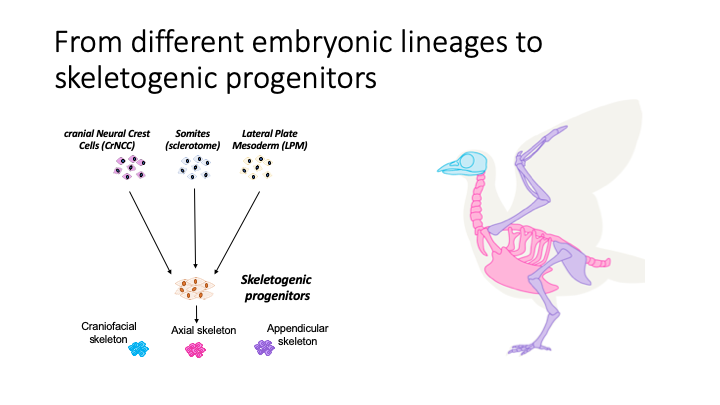
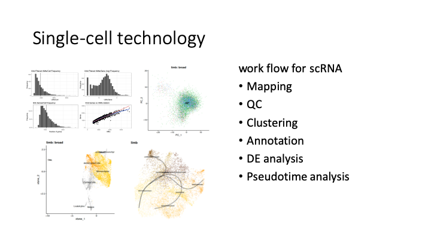
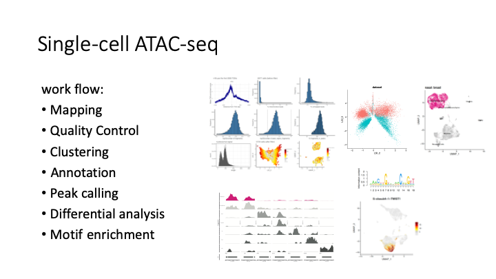

# skeletoConvergence

Chondrogenic cells of the vertebrate skeleton appear similar in all vertebrate body parts, yet they originate from molecularly distinct mesenchymal precursor pools of two different germ layers: the mesoderm, for the axial and appendicular skeleton, and the ectoderm, for the craniofacial skeleton. During their maturation, a spatiotemporally controlled transcriptional recoding thus appears to result in the convergent specification of functionally analogous skeletal cell types. 

To elucidate the gene-regulatory networks leading to the observed functional and transcriptional convergence of skeletogenesis, we sampled different stages of skeletogenesis and profiled both gene expression and open chromatin regions at single-cell resolution. We show that chondrocytes from the three different origins, i.e. forelimb, vertebrae, and frontonasal, are similar in their overall transcriptomes, yet they differ in transcription factor profiles and cis-regulatory landscapes.

## scRNA-seq analysis

**quality control**: filter out low quality cells, based on number of features & counts etc.

**clustering**: based on Seurat pipeline, select highly variable genes, remove batch effect, dimension reduction (PCA & xtSNE) and Louvain clustering, with consideration of cell cycle, mt%, etc.

**convergence**: based on MNN-CCA and Harmony methods, to get integrated expression matrix and integrated embeddings for nasal, somite and limb samples.

**pseudotime**: based on [slingshot](https://github.com/kstreet13/slingshot) algorithm to find a path from progenitor celltype to chondrocytes fate.

## scATAC-seq analysis

**quality control**: filter out low quality cells, based on number of fragments, TSS score, whether is doublet, etc.

**clustering**: based on Signac pipeline, select highly accessible bins, remove batch effect, dimension reduction (LSI & xtSNE) and Leiden clustering.

**peakcall**: using MACS2 to get peak calling for each cluster, then get a consensus peak set for nasal, somite and limb samples.

**convergence**: based on binarization and Harmony methods, to get binarized peak matrix and integrated embeddings for nasal, somite and limb samples.

**pseudotime**: transferred the pseudotime value from scRNA data to scATAC data, via transferData().

**de novo motifs**: using [Homer](http://homer.ucsd.edu/homer/introduction/basics.html) to identify de novo motifs based on highly accessible peaks in each cluster, then annotated them based on motif database (Homer vertebrates, Jaspar20  vertebrates, Cisbp2 chicken) via STAMP, reassigned by correlation between expression (candidate and paralogs) and motif enrichment along pseduotime of chondrogenesis.

**p2g links**: using [ArchR](https://www.archrproject.com/bookdown/peak2genelinkage-with-archr.html) method to generated cell aggregates and computing correlation between imputed gene expression and peak accessibility, identified cis regularoty elements (CREs).

## figure script

scripts used to generate figures for manuscript.

